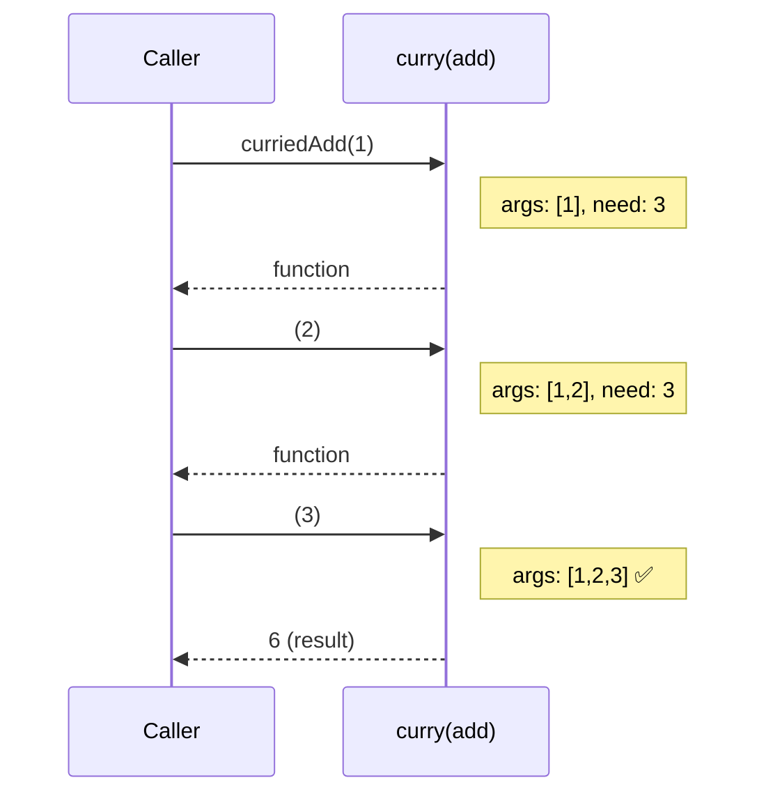
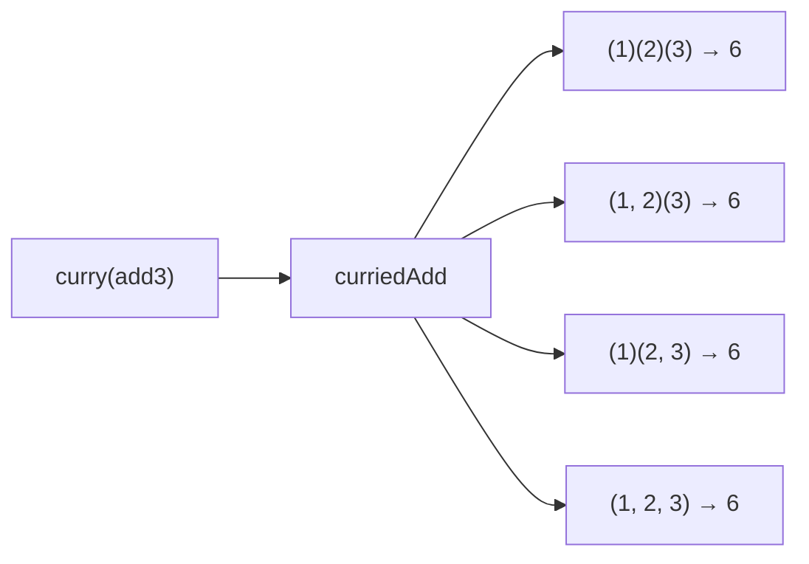
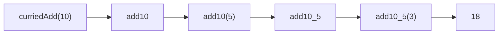

Transforms a function to accept arguments one at a time (or in groups).
Returns a new function for each argument until all are provided, then executes.

### Multiple Call Styles

### Partial Application

