Debounce delays execution until the user **stops calling** for a specified duration.
Each call resets the timer — only the *last* call triggers the function.

```mermaid
sequenceDiagram
    participant U as User
    participant D as debounce
    participant F as func()
    U->>D: call
    Note right of D: ⏱️ start timer
    U->>D: call
    Note right of D: 🔄 reset timer
    U->>D: call
    Note right of D: 🔄 reset timer
    Note right of D: ⏳ wait...
    D->>F: ✅ execute (once)
```

### Debounce vs Throttle

**Debounce** waits for silence — resets on every call.
**Throttle** enforces rhythm — fires at fixed intervals.

| | Debounce | Throttle |
|--|----------|----------|
| **Fires** | Once, after silence | Periodically |
| **Best for** | Search input | Scroll events |