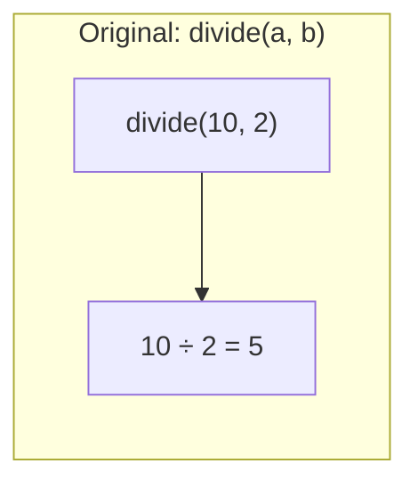
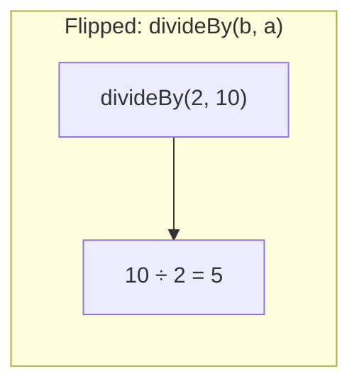
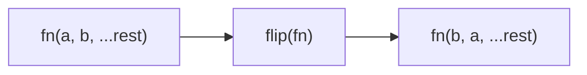

Creates a function with its first two arguments reversed.

```mermaid
flowchart LR
    subgraph "Original: divide(a, b)"
        A1["divide(10, 2)"] --> B1["10 ÷ 2 = 5"]
    end
```

```mermaid
flowchart LR
    subgraph "Flipped: divideBy(b, a)"
        A2["divideBy(2, 10)"] --> B2["10 ÷ 2 = 5"]
    end
```

### Argument Swap

```mermaid
flowchart LR
    A["fn(a, b, ...rest)"] --> B["flip(fn)"]
    B --> C["fn(b, a, ...rest)"]
```
