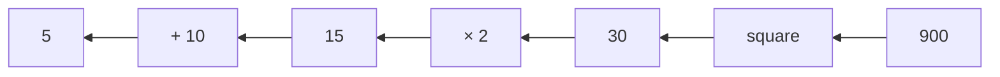
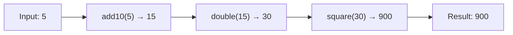
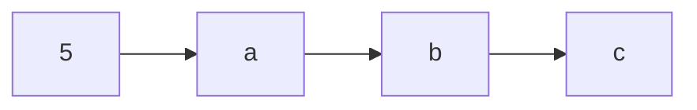
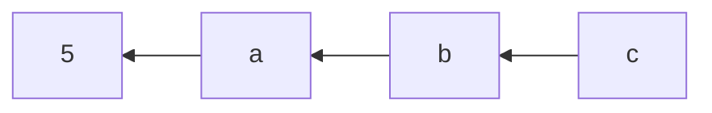

Composes functions right-to-left (mathematical composition).
Also known as `compose` — the rightmost function executes first.

### Step-by-Step

### flowRight vs pipe

| | flowRight | pipe |
|--|-----------|------|
| **Direction** | Right → Left | Left → Right |
| **Math notation** | f(g(h(x))) | h then g then f |
| **First executed** | Last argument | First function |

