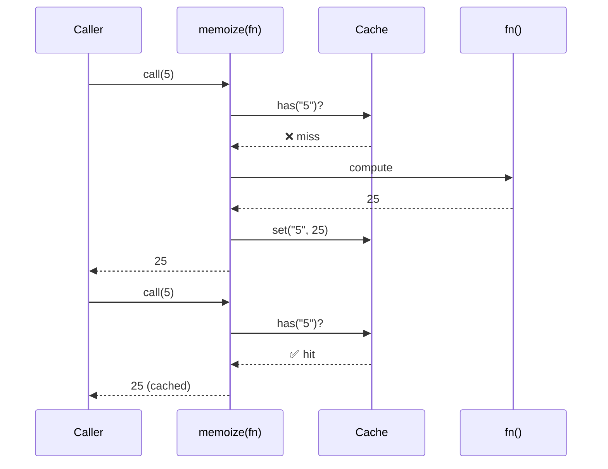
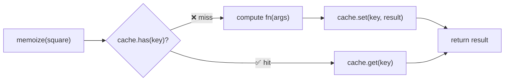
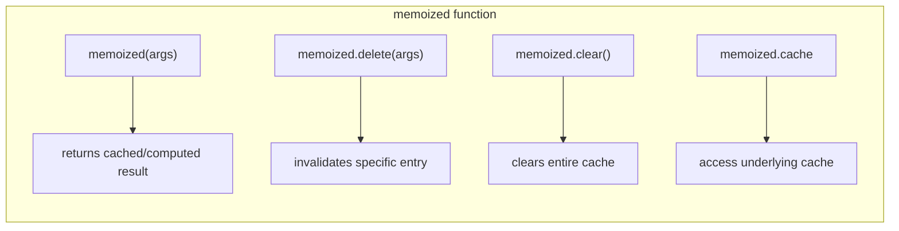

Caches function results based on arguments.
Same arguments return cached result — different arguments compute and cache new result.

```mermaid
sequenceDiagram
    participant C as Caller
    participant M as memoize(fn)
    participant Cache
    participant F as fn()
    
    C->>M: call(5)
    M->>Cache: has("5")?
    Cache-->>M: ❌ miss
    M->>F: compute
    F-->>M: 25
    M->>Cache: set("5", 25)
    M-->>C: 25
    
    C->>M: call(5)
    M->>Cache: has("5")?
    Cache-->>M: ✅ hit
    M-->>C: 25 (cached)
```

### Cache Flow

```mermaid
flowchart LR
    A["memoize(square)"] --> B{"cache.has(key)?"}
    B -->|"❌ miss"| C["compute fn(args)"]
    C --> D["cache.set(key, result)"]
    D --> E["return result"]
    B -->|"✅ hit"| F["cache.get(key)"]
    F --> E
```

### Methods

```mermaid
flowchart LR
    subgraph "memoized function"
        A["memoized(args)"] --> B["returns cached/computed result"]
        C["memoized.delete(args)"] --> D["invalidates specific entry"]
        E["memoized.clear()"] --> F["clears entire cache"]
        G["memoized.cache"] --> H["access underlying cache"]
    end
```
