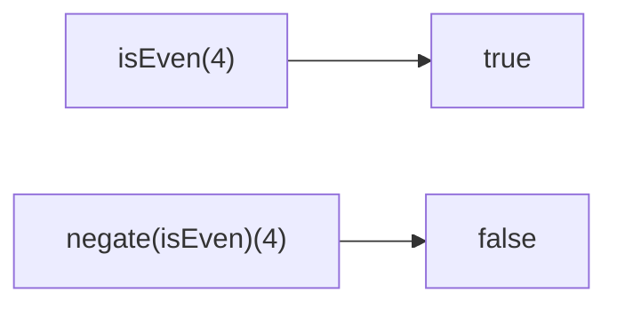
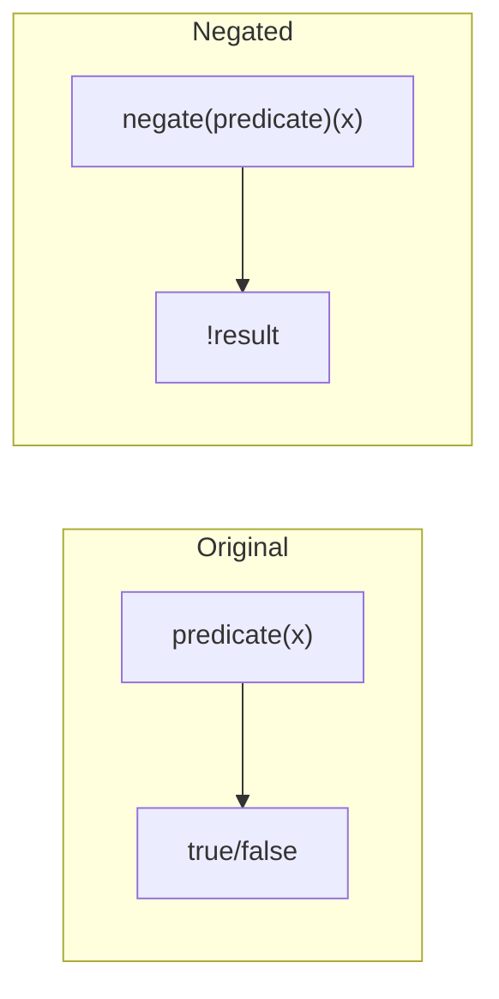
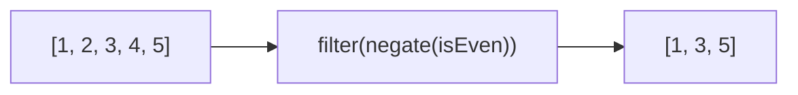

Creates a function that returns the logical negation of the predicate result.

```mermaid
flowchart LR
    A["isEven(4)"] --> B["true"]
    C["negate(isEven)(4)"] --> D["false"]
```

### Transformation

```mermaid
flowchart LR
    subgraph "Original"
        A1["predicate(x)"] --> B1["true/false"]
    end
    subgraph "Negated"
        A2["negate(predicate)(x)"] --> B2["!result"]
    end
```

### Array Filter Example

```mermaid
flowchart LR
    A["[1, 2, 3, 4, 5]"] --> B["filter(negate(isEven))"]
    B --> C["[1, 3, 5]"]
```
