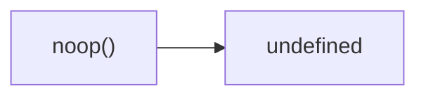
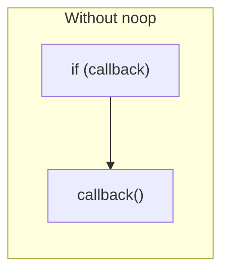
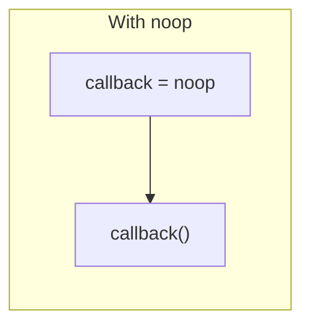

A function that does nothing and returns `undefined`.

```mermaid
flowchart LR
    A["noop()"] --> B["undefined"]
```

### Use Case: Default Callback

```mermaid
flowchart LR
    subgraph "Without noop"
        A1["if (callback)"] --> B1["callback()"]
    end
```

```mermaid
flowchart LR
    subgraph "With noop"
        A2["callback = noop"] --> B2["callback()"]
    end
```
