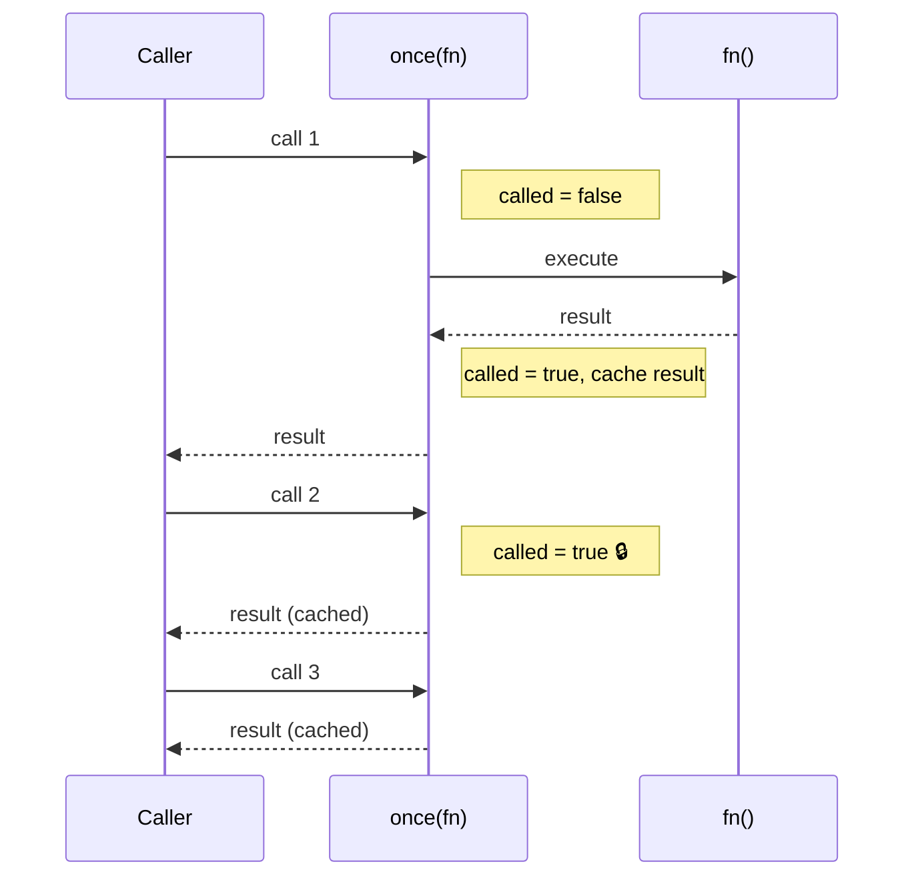
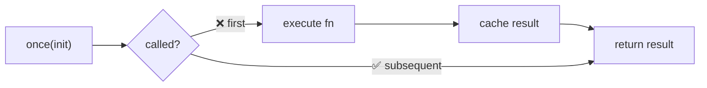
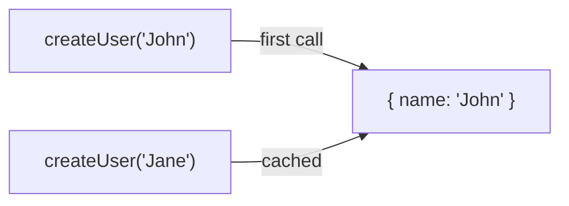

Creates a function that executes only once — subsequent calls return the cached result.

```mermaid
sequenceDiagram
    participant C as Caller
    participant O as once(fn)
    participant F as fn()
    
    C->>O: call 1
    Note right of O: called = false
    O->>F: execute
    F-->>O: result
    Note right of O: called = true, cache result
    O-->>C: result
    
    C->>O: call 2
    Note right of O: called = true 🔒
    O-->>C: result (cached)
    
    C->>O: call 3
    O-->>C: result (cached)
```

### Simple Flow

```mermaid
flowchart LR
    A["once(init)"] --> B{"called?"}
    B -->|"❌ first"| C["execute fn"]
    C --> D["cache result"]
    D --> E["return result"]
    B -->|"✅ subsequent"| E
```

### Key Behavior

New arguments are ignored after the first call:

```mermaid
flowchart LR
    A["createUser('John')"] -->|"first call"| B["{ name: 'John' }"]
    C["createUser('Jane')"] -->|"cached"| B
```
