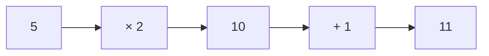
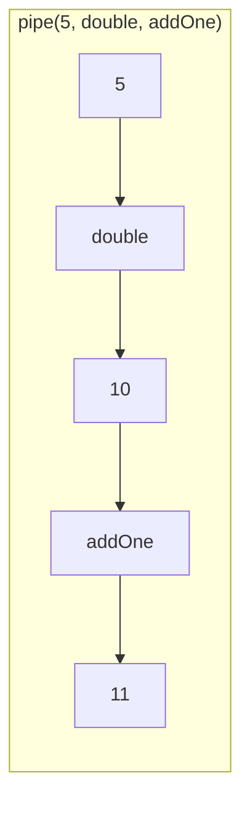
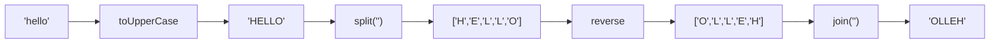

Composes functions left-to-right, passing each result to the next function.

### Step-by-Step

### String Transformation Example

### pipe vs flowRight

| | pipe | flowRight |
|--|------|-----------|
| **Direction** | Left → Right | Right → Left |
| **First arg** | Initial value | Last function |
| **Mental model** | Data flows through | Math composition |
