Throttle enforces a **maximum execution rate** — the function fires at most once per interval.
Calls during the cooldown are ignored, ensuring consistent rhythm regardless of input frequency.

```mermaid
sequenceDiagram
    participant U as User
    participant T as throttle
    participant F as func()
    U->>T: call
    T->>F: ✅ execute
    Note right of T: 🔒 cooldown starts
    U->>T: call
    Note right of T: ⏸️ ignored
    U->>T: call
    Note right of T: ⏸️ ignored
    Note right of T: ⏱️ cooldown ends
    U->>T: call
    T->>F: ✅ execute
    Note right of T: 🔒 cooldown starts
```

### Throttle vs Debounce

**Throttle** enforces rhythm — fires at fixed intervals regardless of call frequency.
**Debounce** waits for silence — resets on every call.

| | Throttle | Debounce |
|--|----------|----------|
| **Fires** | Periodically | Once, after silence |
| **Best for** | Scroll events | Search input |