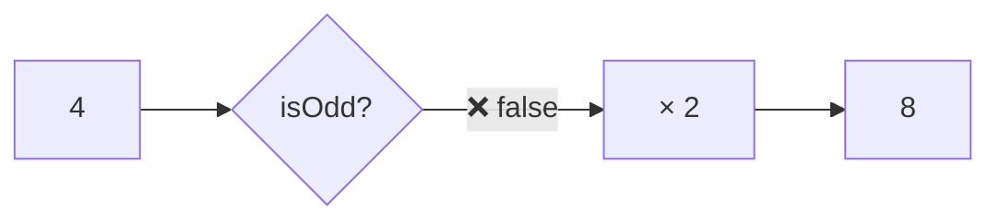
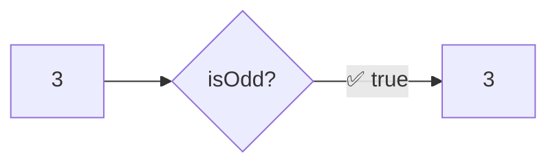

Applies a transformation only when the predicate returns `false`.
If predicate is `true`, returns the original value unchanged. Logical opposite of `when`.

### Predicate False (transforms)

### Predicate True (skips)

### unless vs when

| Input | `when(x, isOdd, double)` | `unless(x, isOdd, double)` |
|-------|--------------------------|----------------------------|
| 3 (odd) | ✅ transforms → 6 | ❌ skips → 3 |
| 4 (even) | ❌ skips → 4 | ✅ transforms → 8 |
