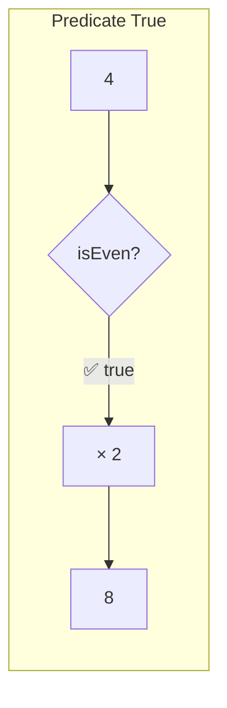
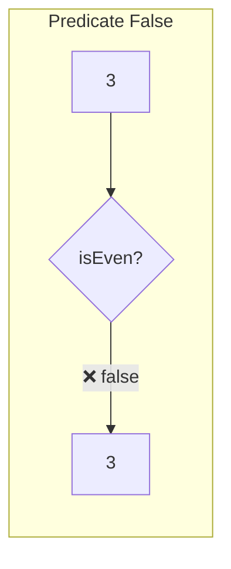

Applies a transformation only when the predicate returns `true`.
If predicate is `false`, returns the original value unchanged.

### when vs unless

| | when | unless |
|--|------|--------|
| **Transforms if** | predicate = true | predicate = false |
| **Skips if** | predicate = false | predicate = true |
