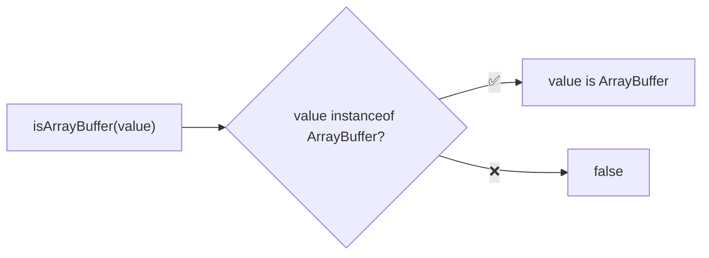
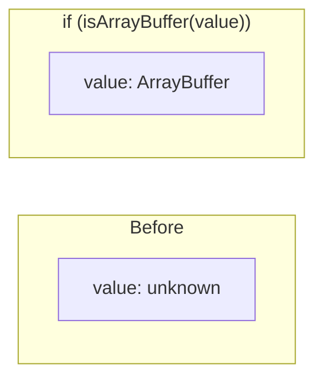

Type guard that checks if a value is an ArrayBuffer.

### Type Narrowing

### Common Checks

| Value | Result |
|-------|--------|
| `new ArrayBuffer(8)` | ✅ true |
| `new Uint8Array(8).buffer` | ✅ true |
| `new Uint8Array(8)` | ❌ false |
| `Buffer.alloc(8)` | ❌ false |
| `[]` | ❌ false |
