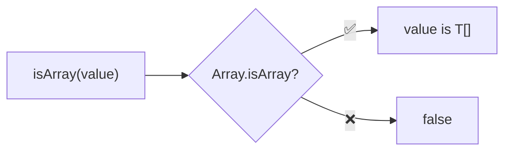
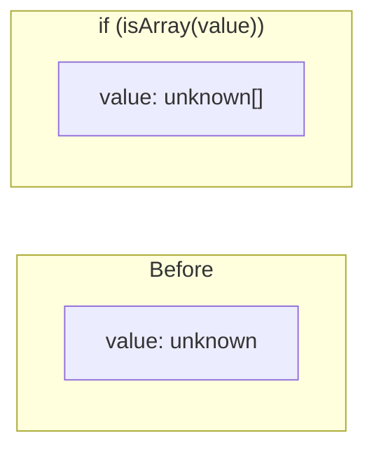

Type guard that checks if a value is an array.

### Type Narrowing

### Common Checks

| Value | Result |
|-------|--------|
| `[1, 2, 3]` | ✅ true |
| `[]` | ✅ true |
| `'hello'` | ❌ false |
| `{ length: 3 }` | ❌ false |
| `new Set([1, 2])` | ❌ false |
