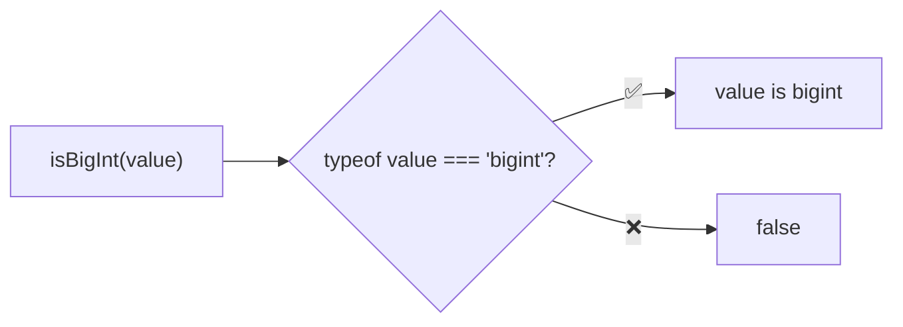
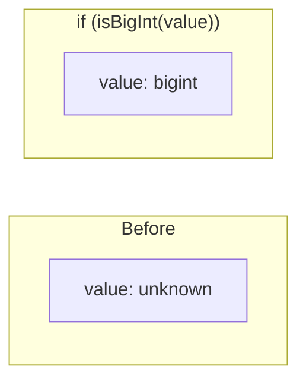

Type guard that checks if a value is a bigint.

### Type Narrowing

### Common Checks

| Value | Result |
|-------|--------|
| `123n` | ✅ true |
| `BigInt(123)` | ✅ true |
| `123` | ❌ false |
| `'123'` | ❌ false |
| `new Object(123n)` | ❌ false |
