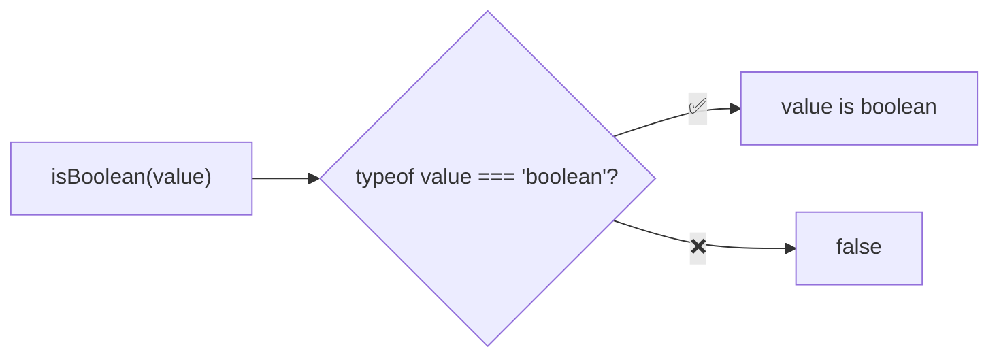
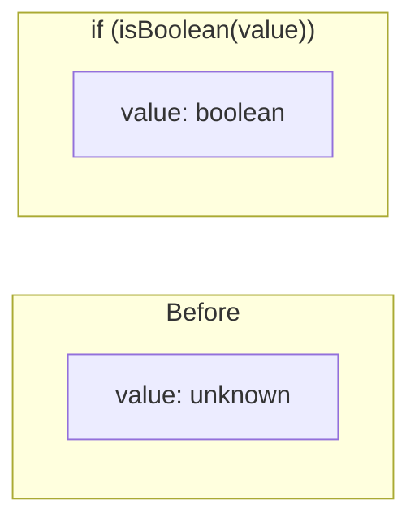

Type guard that checks if a value is a boolean.

### Type Narrowing

### Common Checks

| Value | Result |
|-------|--------|
| `true` | ✅ true |
| `false` | ✅ true |
| `Boolean(1)` | ✅ true |
| `new Boolean(true)` | ❌ false (boxed) |
| `1` | ❌ false |
| `'true'` | ❌ false |
