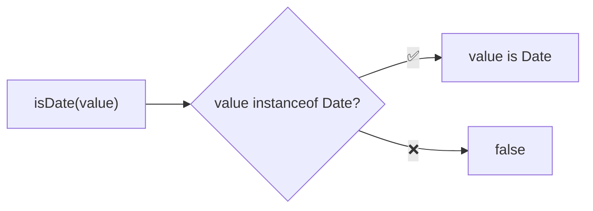
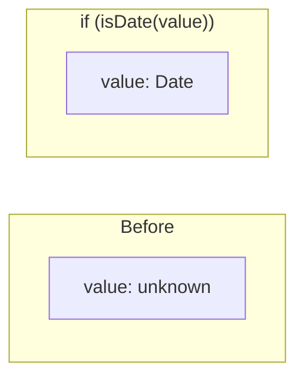

Type guard that checks if a value is a Date instance.

### Type Narrowing

### Common Checks

| Value | Result |
|-------|--------|
| `new Date()` | ✅ true |
| `new Date('invalid')` | ✅ true (Invalid Date is still Date) |
| `Date.now()` | ❌ false (number) |
| `'2024-01-01'` | ❌ false |
| `1704067200000` | ❌ false |

### Note

`isDate` returns true for Invalid Date. Use `!isNaN(date.getTime())` to check validity.
