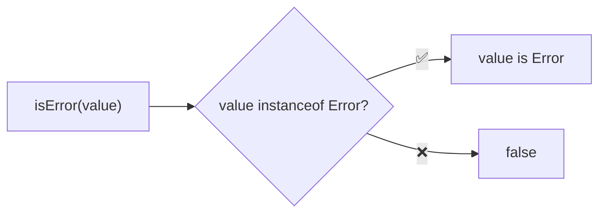
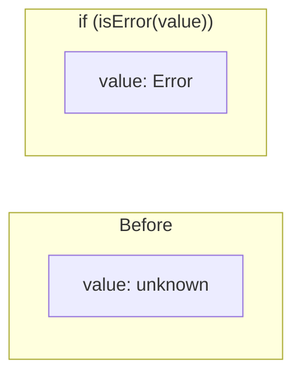

Type guard that checks if a value is an Error instance.

### Type Narrowing

### Common Checks

| Value | Result |
|-------|--------|
| `new Error('msg')` | ✅ true |
| `new TypeError('msg')` | ✅ true |
| `new RangeError('msg')` | ✅ true |
| `new SyntaxError('msg')` | ✅ true |
| `{ message: 'error' }` | ❌ false |
| `'Error'` | ❌ false |
