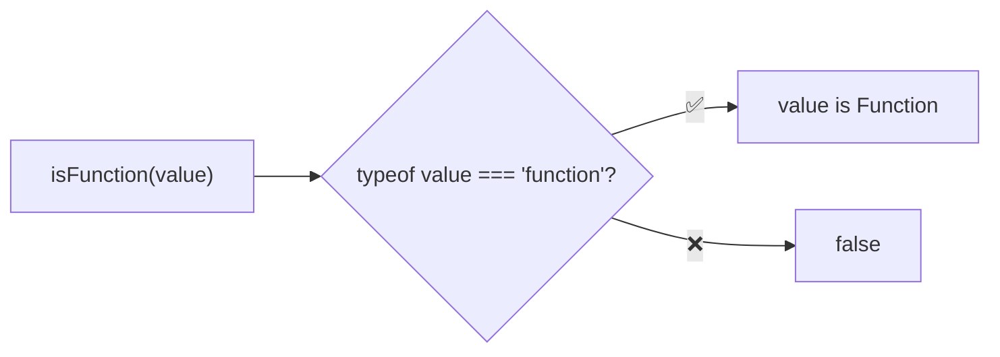
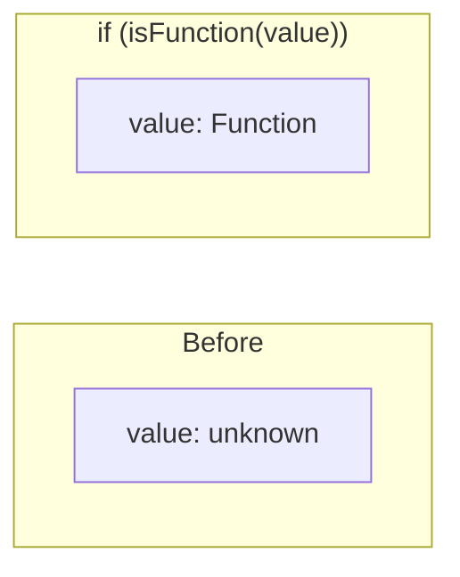

Type guard that checks if a value is a function.

### Type Narrowing

### Common Checks

| Value | Result |
|-------|--------|
| `() => {}` | ✅ true |
| `function() {}` | ✅ true |
| `async () => {}` | ✅ true |
| `class Foo {}` | ✅ true |
| `Array.isArray` | ✅ true |
| `{ call: () => {} }` | ❌ false |
