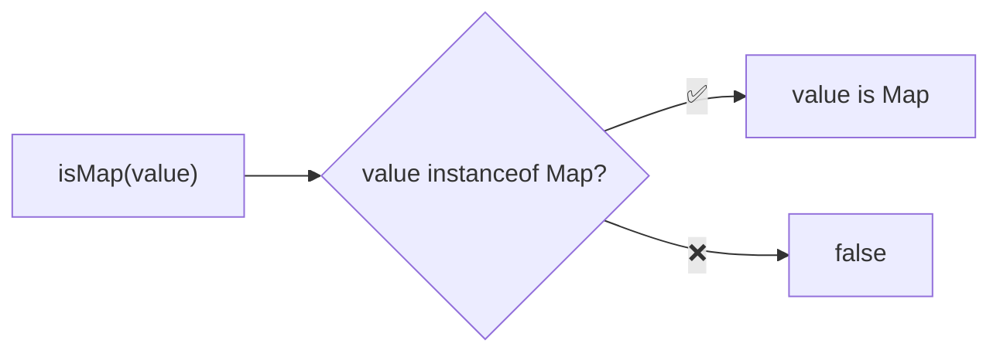
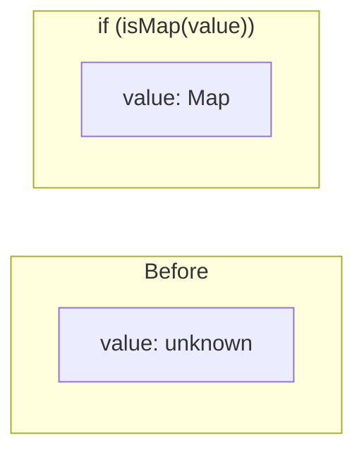

Type guard that checks if a value is a Map.

### Type Narrowing

### Common Checks

| Value | Result |
|-------|--------|
| `new Map()` | ✅ true |
| `new Map([['a', 1]])` | ✅ true |
| `new WeakMap()` | ❌ false |
| `{}` | ❌ false |
| `Object.fromEntries([])` | ❌ false |
