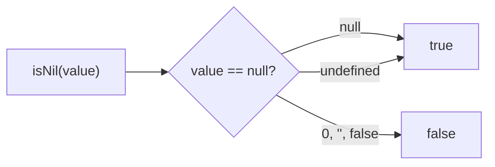
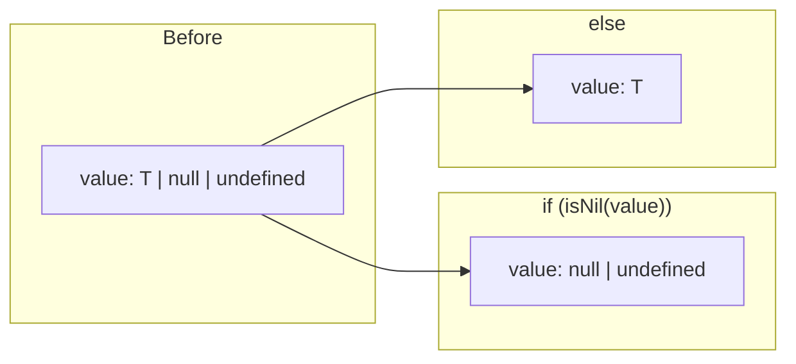

Type guard that checks if a value is `null` or `undefined`.

### Narrowing

### Falsy vs Nil

| Value | `isNil` | `!value` |
|-------|---------|----------|
| `null` | ✅ true | ✅ true |
| `undefined` | ✅ true | ✅ true |
| `0` | ❌ false | ✅ true |
| `''` | ❌ false | ✅ true |
| `false` | ❌ false | ✅ true |
