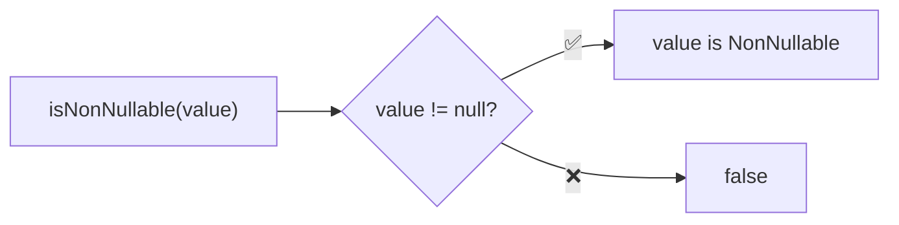
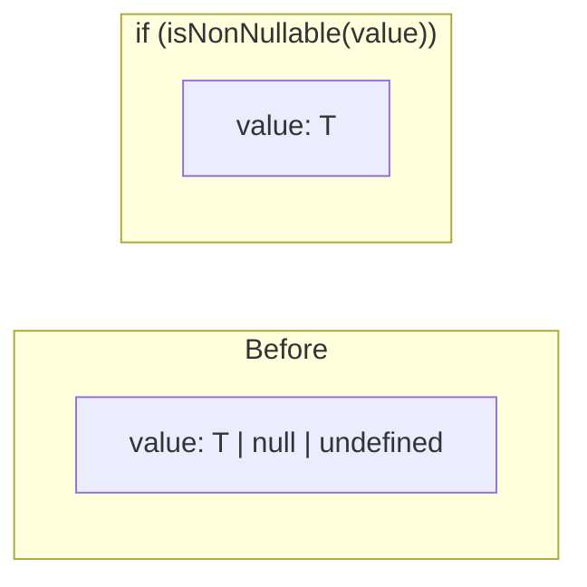

Type guard that checks if a value is not null or undefined.

### Type Narrowing

### Common Checks

| Value | Result |
|-------|--------|
| `0` | ✅ true |
| `''` | ✅ true |
| `false` | ✅ true |
| `NaN` | ✅ true |
| `null` | ❌ false |
| `undefined` | ❌ false |

### Comparison

| Guard | Excludes |
|-------|----------|
| `isNonNull` | `null` |
| `isNonUndefined` | `undefined` |
| `isNonNullable` | `null` AND `undefined` |
