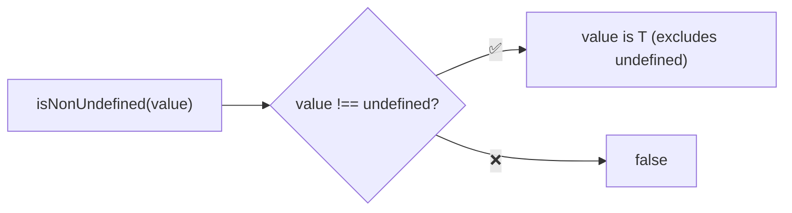
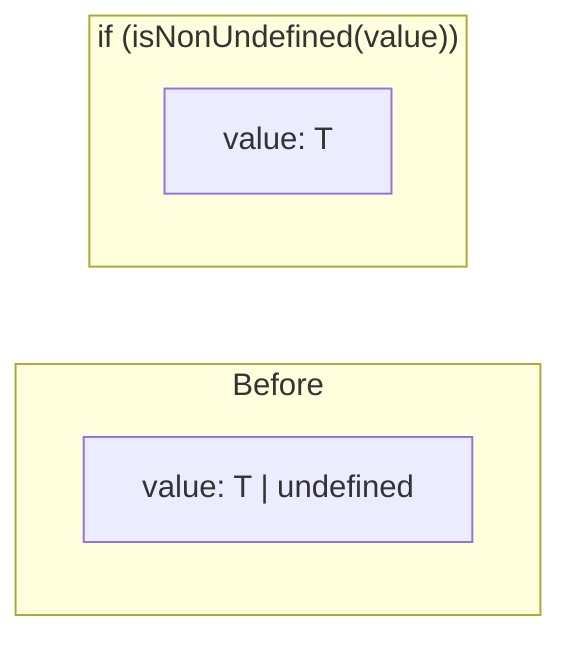
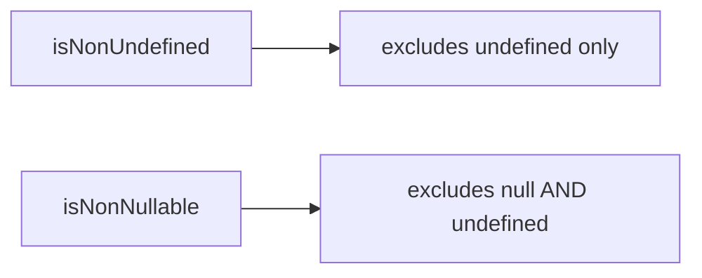

Type guard that checks if a value is not undefined.

### Type Narrowing

### Common Checks

| Value | Result |
|-------|--------|
| `null` | ✅ true |
| `0` | ✅ true |
| `''` | ✅ true |
| `false` | ✅ true |
| `undefined` | ❌ false |

### vs isNonNullable

