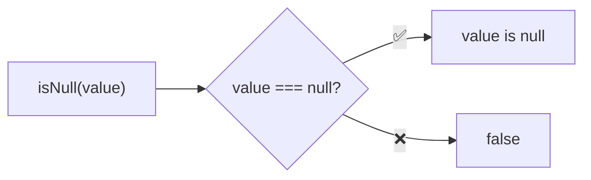
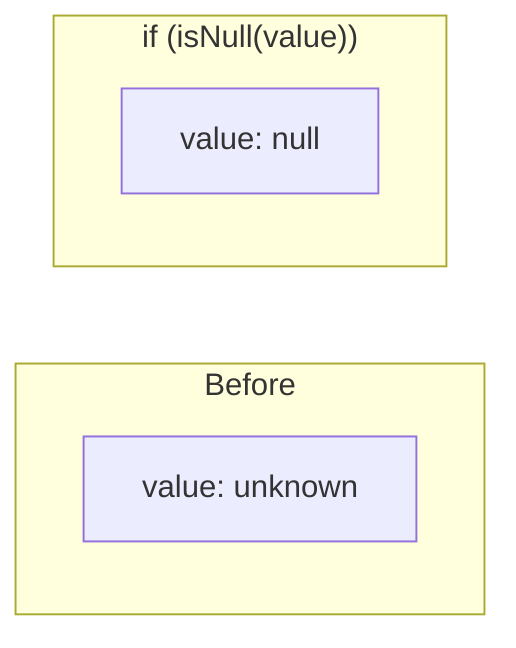
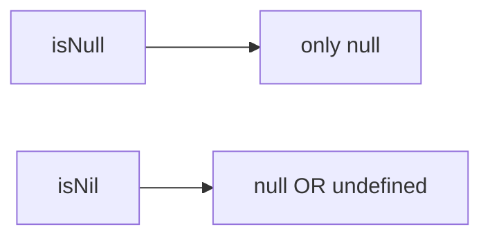

Type guard that checks if a value is null.

### Type Narrowing

### Common Checks

| Value | Result |
|-------|--------|
| `null` | ✅ true |
| `undefined` | ❌ false |
| `0` | ❌ false |
| `''` | ❌ false |
| `false` | ❌ false |

### vs isNil

