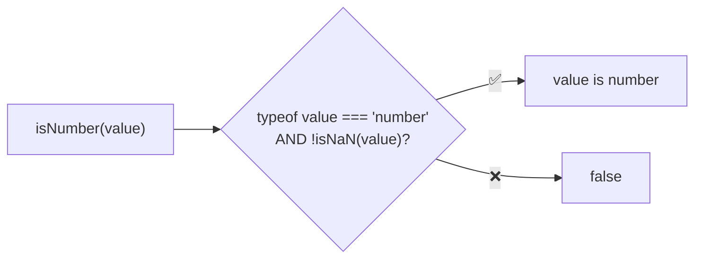
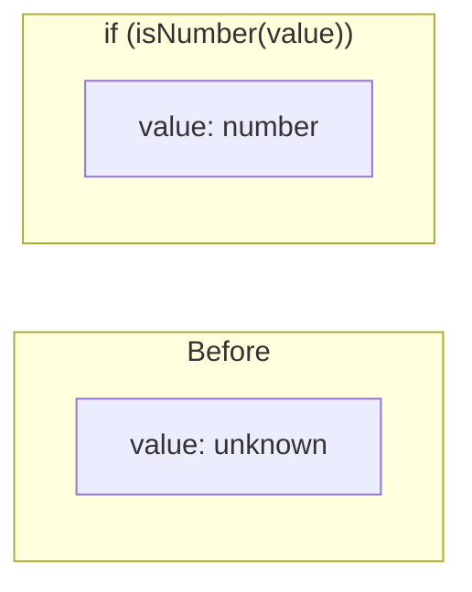

Type guard that checks if a value is a number (excluding NaN).

### Type Narrowing

### Common Checks

| Value | Result |
|-------|--------|
| `123` | ✅ true |
| `0` | ✅ true |
| `-1.5` | ✅ true |
| `Infinity` | ✅ true |
| `NaN` | ❌ false |
| `'123'` | ❌ false |
| `new Number(123)` | ❌ false (boxed) |

### Note

Unlike `typeof x === 'number'`, this guard excludes `NaN` for safer number handling.
