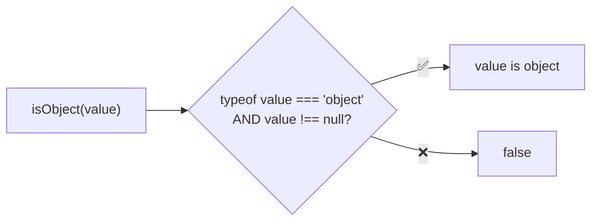
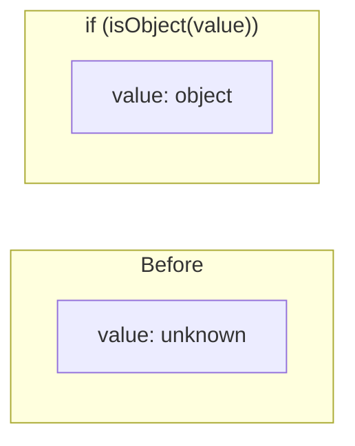
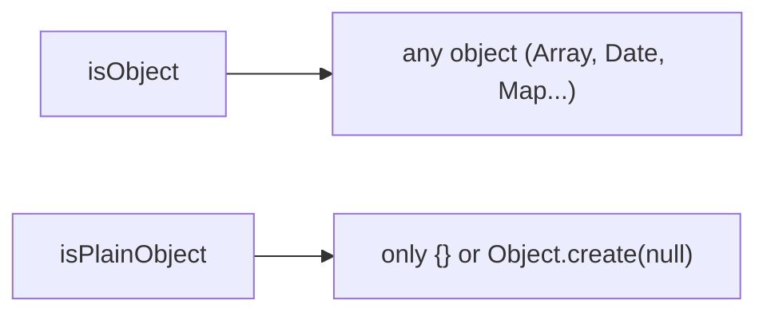

Type guard that checks if a value is an object (not null).

### Type Narrowing

### Common Checks

| Value | Result |
|-------|--------|
| `{}` | ✅ true |
| `[]` | ✅ true |
| `new Date()` | ✅ true |
| `new Map()` | ✅ true |
| `() => {}` | ❌ false |
| `null` | ❌ false |
| `'string'` | ❌ false |

### vs isPlainObject

