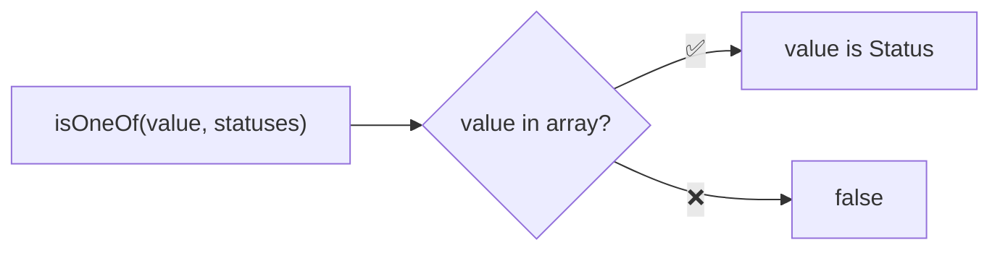
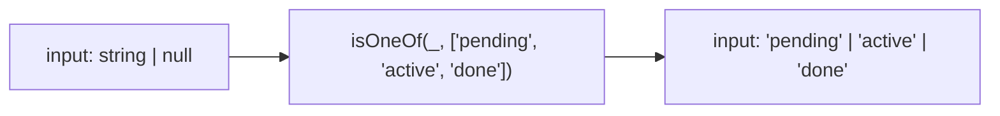
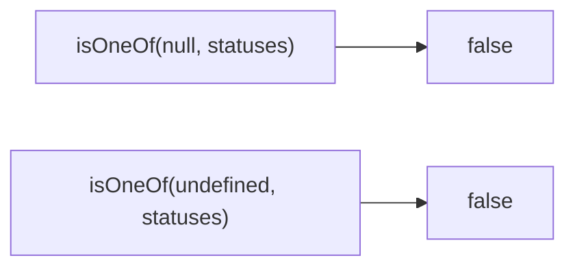
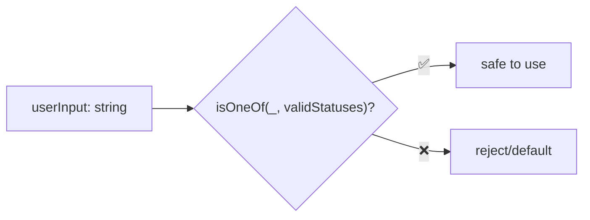

Type guard that checks if a value is one of the values in a readonly array.
Useful for validating string unions at runtime.

```mermaid
flowchart LR
    A["isOneOf(value, statuses)"] --> B{"value in array?"}
    B -->|"✅"| C["value is Status"]
    B -->|"❌"| D["false"]
```

### Type Narrowing

```mermaid
flowchart LR
    A["input: string | null"] --> B["isOneOf(_, ['pending', 'active', 'done'])"]
    B --> C["input: 'pending' | 'active' | 'done'"]
```

### Null Safety

```mermaid
flowchart LR
    A["isOneOf(null, statuses)"] --> B["false"]
    C["isOneOf(undefined, statuses)"] --> D["false"]
```

### Use Case: API Validation

```mermaid
flowchart LR
    A["userInput: string"] --> B{"isOneOf(_, validStatuses)?"}
    B -->|"✅"| C["safe to use"]
    B -->|"❌"| D["reject/default"]
```
