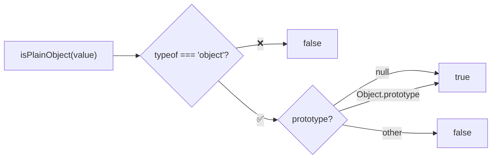
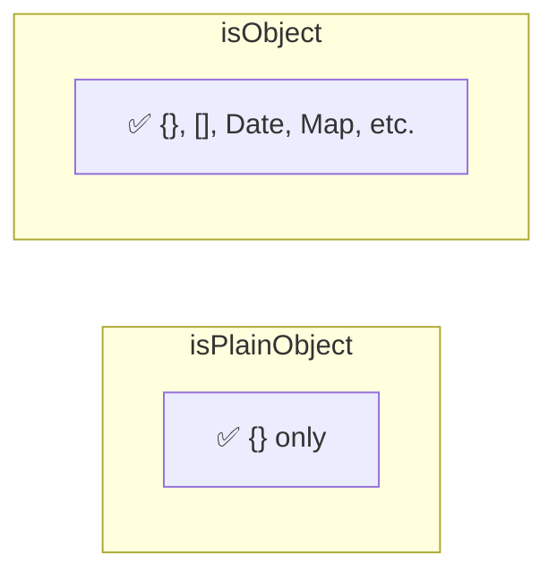

Type guard that checks if a value is a plain object (object literal or `Object.create(null)`).

### What Qualifies

| Value | Result | Reason |
|-------|--------|--------|
| `{}` | ✅ true | Object literal |
| `{ a: 1 }` | ✅ true | Object literal |
| `new Object()` | ✅ true | Object constructor |
| `Object.create(null)` | ✅ true | Null prototype |
| `[]` | ❌ false | Array |
| `new Date()` | ❌ false | Date instance |
| `new Map()` | ❌ false | Map instance |
| `new MyClass()` | ❌ false | Class instance |
| `null` | ❌ false | Not an object |

### isPlainObject vs isObject

