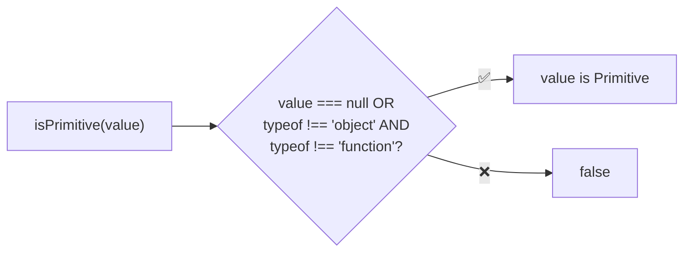
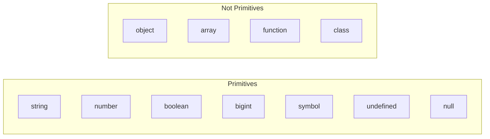

Type guard that checks if a value is a primitive type.

### Primitive Types

### Common Checks

| Value | Result |
|-------|--------|
| `'hello'` | ✅ true |
| `123` | ✅ true |
| `true` | ✅ true |
| `null` | ✅ true |
| `undefined` | ✅ true |
| `Symbol()` | ✅ true |
| `123n` | ✅ true |
| `{}` | ❌ false |
| `[]` | ❌ false |
| `() => {}` | ❌ false |
