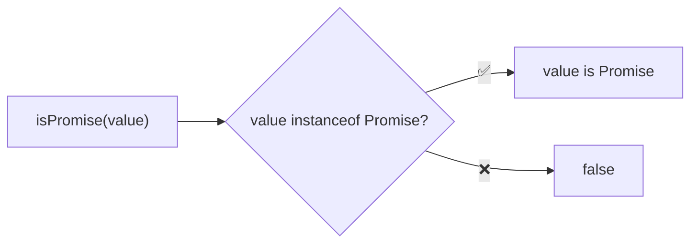
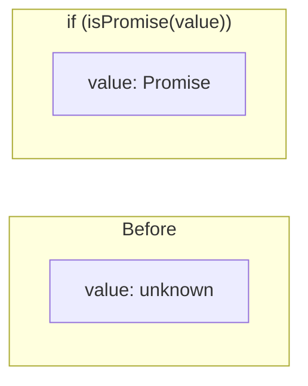

Type guard that checks if a value is a Promise.

### Type Narrowing

### Common Checks

| Value | Result |
|-------|--------|
| `Promise.resolve(1)` | ✅ true |
| `new Promise(() => {})` | ✅ true |
| `async () => {}` | ❌ false (function) |
| `(async () => {})()` | ✅ true (called) |
| `{ then: () => {} }` | ❌ false (thenable) |

### Note

This checks for native Promise instances. Thenables (objects with `.then()`) are not detected.
