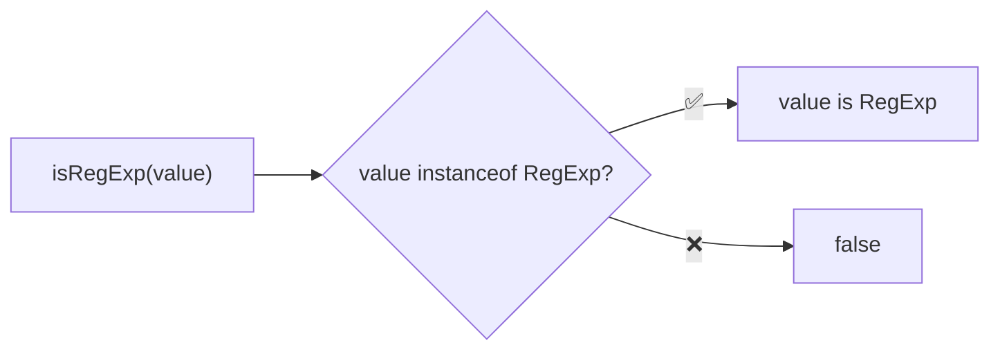
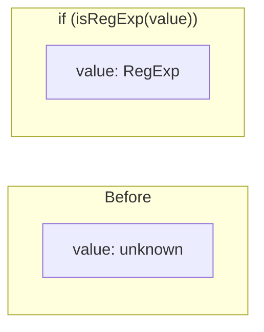

Type guard that checks if a value is a RegExp.

### Type Narrowing

### Common Checks

| Value | Result |
|-------|--------|
| `/abc/` | ✅ true |
| `/abc/gi` | ✅ true |
| `new RegExp('abc')` | ✅ true |
| `'/abc/'` | ❌ false (string) |
| `{ test: () => {} }` | ❌ false |
