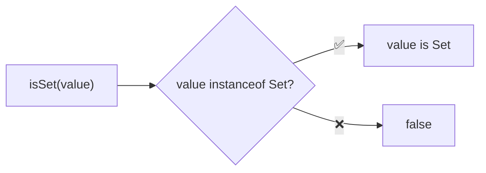
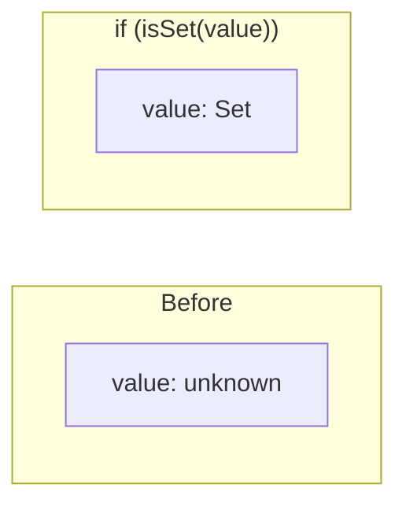

Type guard that checks if a value is a Set.

### Type Narrowing

### Common Checks

| Value | Result |
|-------|--------|
| `new Set()` | ✅ true |
| `new Set([1, 2, 3])` | ✅ true |
| `new WeakSet()` | ❌ false |
| `[]` | ❌ false |
| `{ add: () => {} }` | ❌ false |
