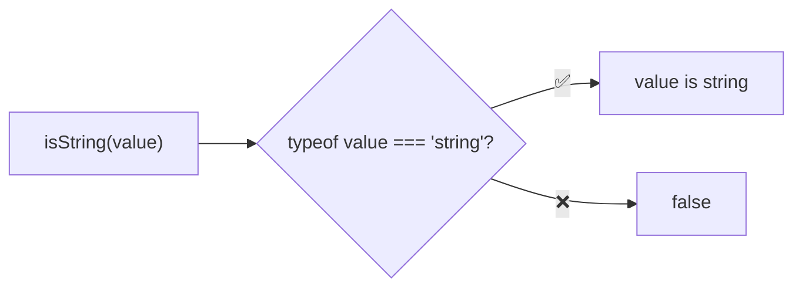
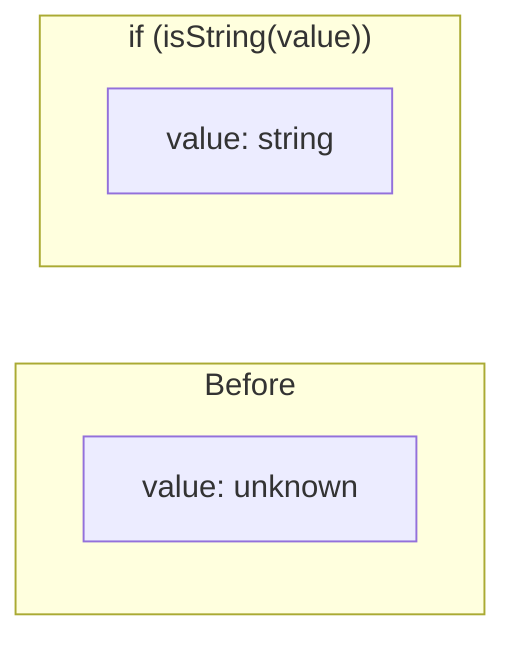

Type guard that checks if a value is a string.

### Type Narrowing

### Common Checks

| Value | Result |
|-------|--------|
| `'hello'` | ✅ true |
| `''` | ✅ true |
| `` `template` `` | ✅ true |
| `String(123)` | ✅ true |
| `new String('hello')` | ❌ false (boxed) |
| `123` | ❌ false |
| `['h', 'i']` | ❌ false |
