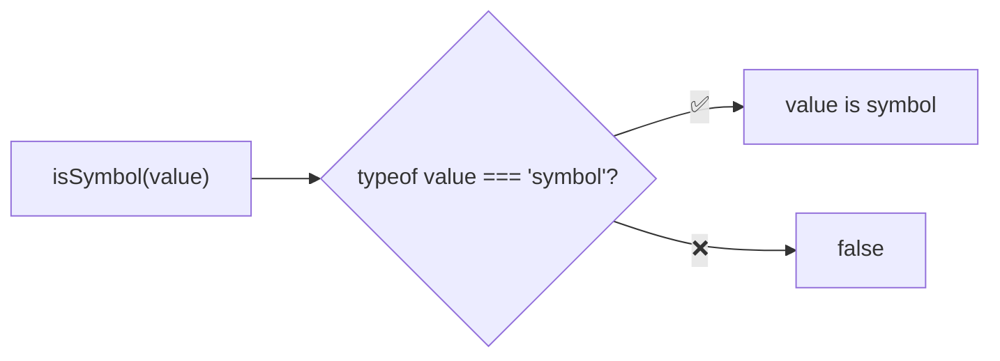
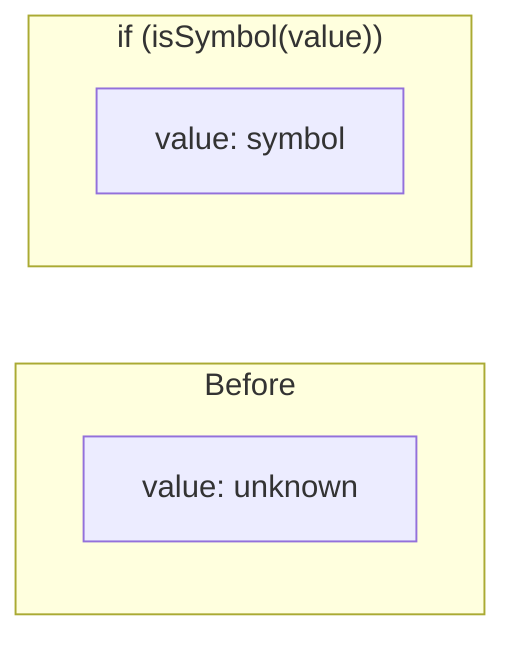

Type guard that checks if a value is a symbol.

### Type Narrowing

### Common Checks

| Value | Result |
|-------|--------|
| `Symbol()` | ✅ true |
| `Symbol('desc')` | ✅ true |
| `Symbol.for('key')` | ✅ true |
| `Symbol.iterator` | ✅ true |
| `'Symbol()'` | ❌ false |
| `{ [Symbol()]: 1 }` | ❌ false (object) |
