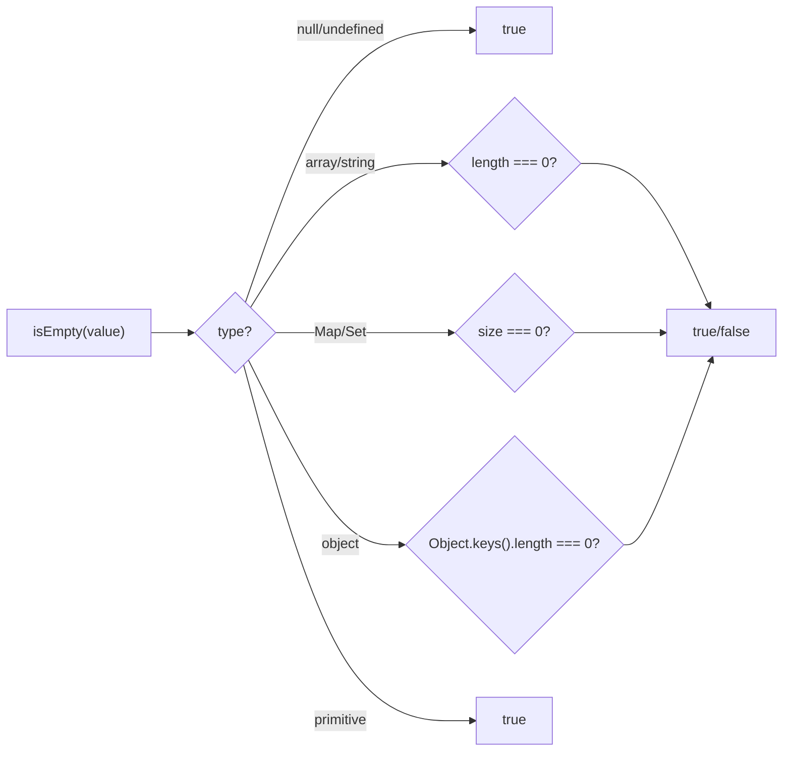
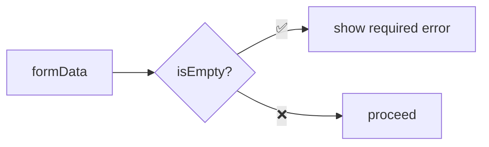

Checks if a value is empty (arrays, objects, strings, Map, Set).

### Examples

| Value | Result |
|-------|--------|
| `[]` | ✅ true |
| `[1, 2]` | ❌ false |
| `{}` | ✅ true |
| `{ a: 1 }` | ❌ false |
| `''` | ✅ true |
| `'abc'` | ❌ false |
| `new Map()` | ✅ true |
| `new Set([1])` | ❌ false |
| `null` | ✅ true |
| `42` | ✅ true (primitives are "empty") |

### Use Case: Form Validation

