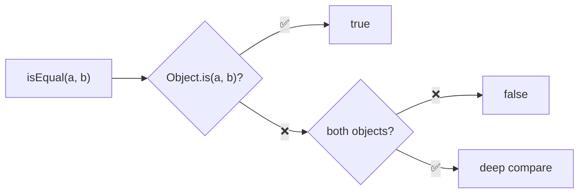
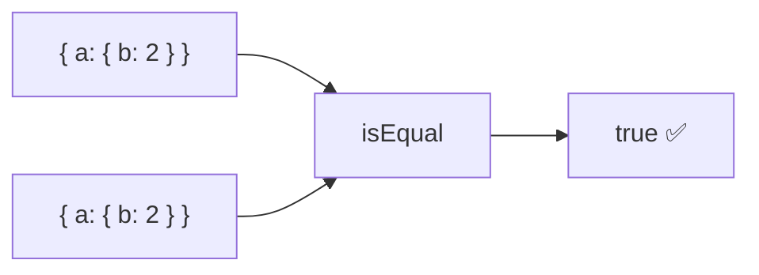
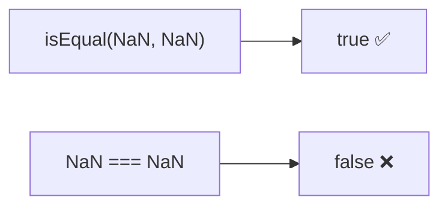
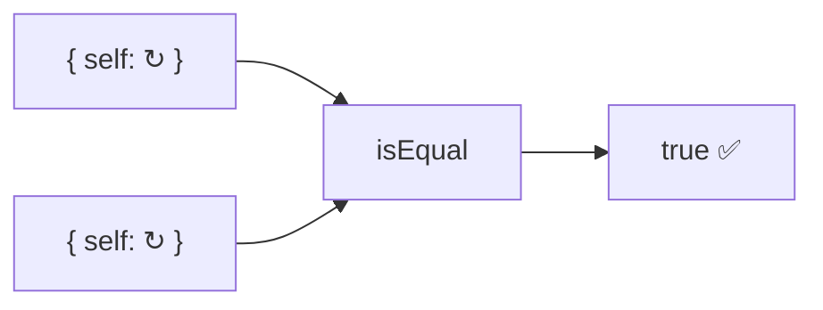

Performs deep comparison between two values to determine equivalence.

### Deep Comparison

### Supported Types

| Type | Comparison |
|------|------------|
| Primitives | `Object.is` (NaN === NaN) |
| Arrays | Element-by-element |
| Objects | Property-by-property |
| Date | Timestamp comparison |
| RegExp | Source + flags |
| Map | Key-value pairs |
| Set | All elements |

### NaN Handling

### Circular References

