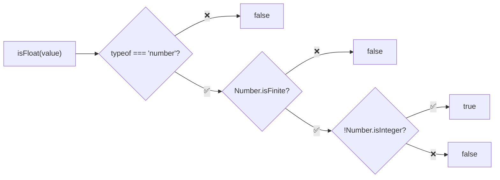
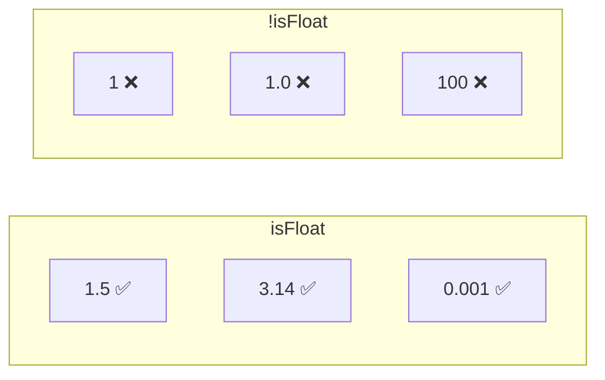

Checks if a value is a float (finite number with decimal part).

### Examples

| Value | Result | Reason |
|-------|--------|--------|
| `1.5` | ✅ true | Has decimal |
| `1.0` | ❌ false | No decimal part |
| `1` | ❌ false | Integer |
| `Infinity` | ❌ false | Not finite |
| `-Infinity` | ❌ false | Not finite |
| `NaN` | ❌ false | Not finite |
| `'1.5'` | ❌ false | Not a number |

### Float vs Integer

