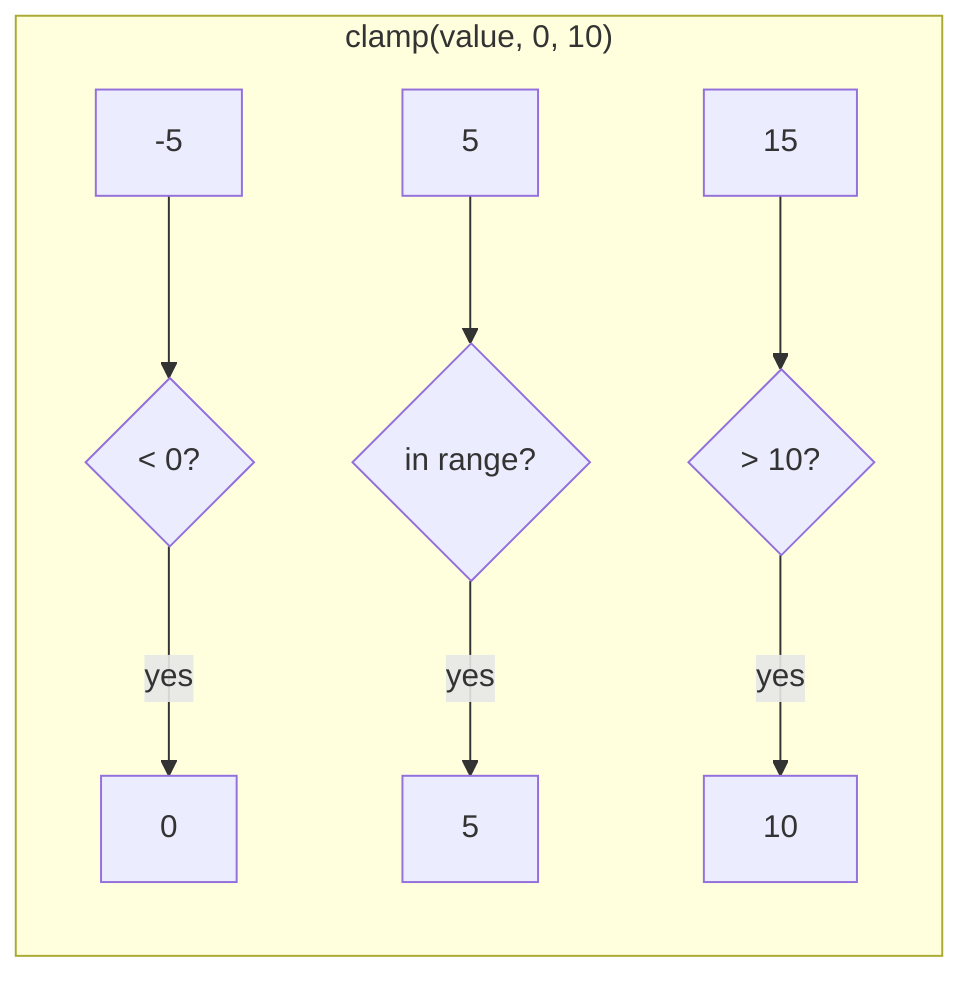
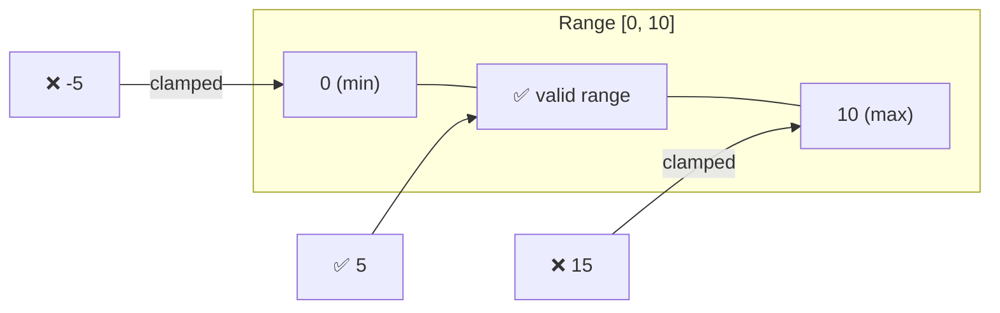

Restricts a value to stay within a specified range.
If below min, returns min. If above max, returns max. Otherwise, returns the value unchanged.

```mermaid
flowchart LR
    subgraph "clamp(value, 0, 10)"
        A["-5"] --> B{"< 0?"} -->|"yes"| C["0"]
        D["5"] --> E{"in range?"} -->|"yes"| F["5"]
        G["15"] --> H{"> 10?"} -->|"yes"| I["10"]
    end
```

### Visual Range

```mermaid
flowchart LR
    subgraph "Range [0, 10]"
        direction LR
        MIN["0 (min)"] --- VALID["✅ valid range"] --- MAX["10 (max)"]
    end
    
    LOW["❌ -5"] -->|"clamped"| MIN
    OK["✅ 5"] --> VALID
    HIGH["❌ 15"] -->|"clamped"| MAX
```
