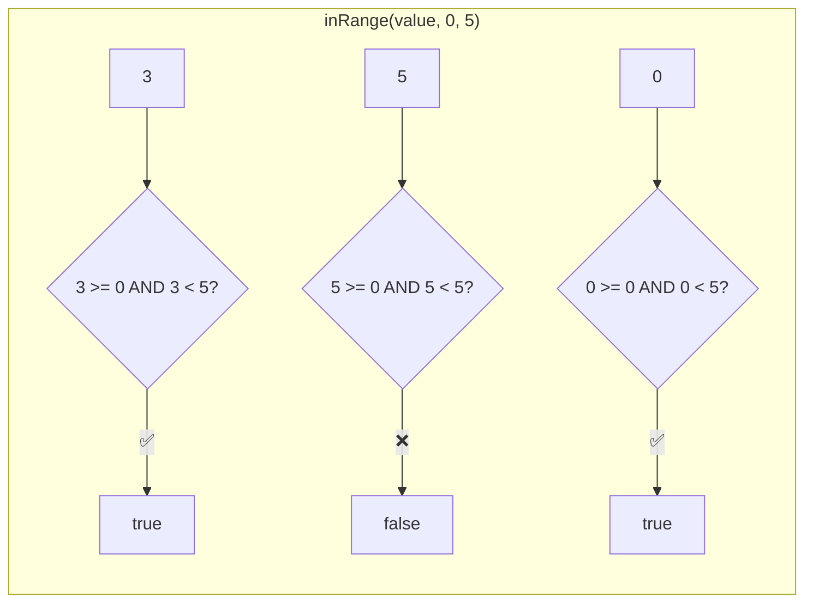
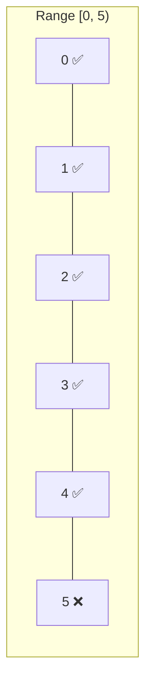
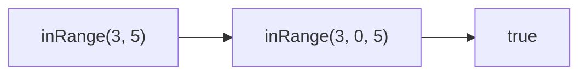

Checks if a number falls within a specified range (min inclusive, max exclusive).

```mermaid
flowchart LR
    subgraph "inRange(value, 0, 5)"
        A["3"] --> B{"3 >= 0 AND 3 < 5?"} -->|"✅"| C["true"]
        D["5"] --> E{"5 >= 0 AND 5 < 5?"} -->|"❌"| F["false"]
        G["0"] --> H{"0 >= 0 AND 0 < 5?"} -->|"✅"| I["true"]
    end
```

### Range Visualization

```mermaid
flowchart LR
    subgraph "Range [0, 5)"
        A["0 ✅"] --- B["1 ✅"] --- C["2 ✅"] --- D["3 ✅"] --- E["4 ✅"] --- F["5 ❌"]
    end
```

### Single Argument (0 to max)

```mermaid
flowchart LR
    A["inRange(3, 5)"] --> B["inRange(3, 0, 5)"]
    B --> C["true"]
```
