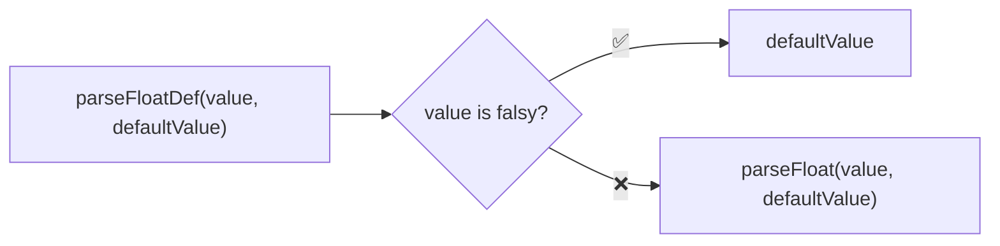
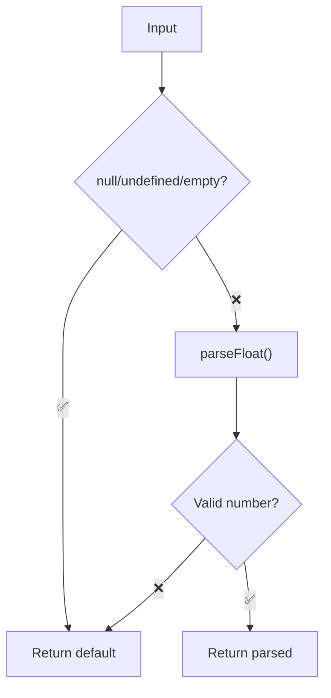

Parses a string to a float with a fallback default value, handling nullish inputs.

### Validation Flow

### Common Inputs

| Value | Default | Result |
|-------|---------|--------|
| `'42.99'` | `0` | `42.99` |
| `'invalid'` | `0` | `0` |
| `''` | `10.5` | `10.5` |
| `null` | `1.0` | `1.0` |
| `undefined` | `5` | `5` |
