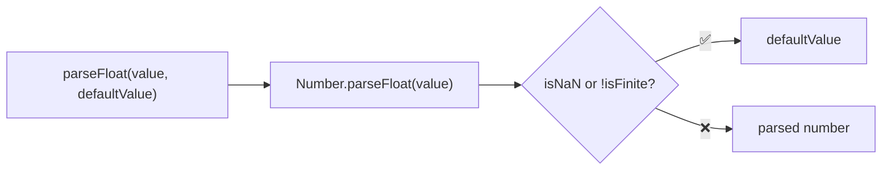
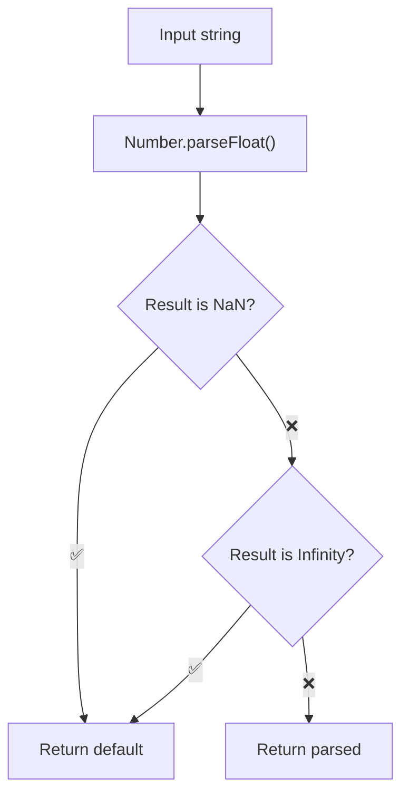

Parses a string to a float, returning default if invalid.

### Validation Flow

### Common Inputs

| Value | Default | Result |
|-------|---------|--------|
| `'42.99'` | `0` | `42.99` |
| `'invalid'` | `0` | `0` |
| `'Infinity'` | `0` | `0` |
| `'NaN'` | `100` | `100` |
| `'3.14abc'` | `0` | `3.14` |
