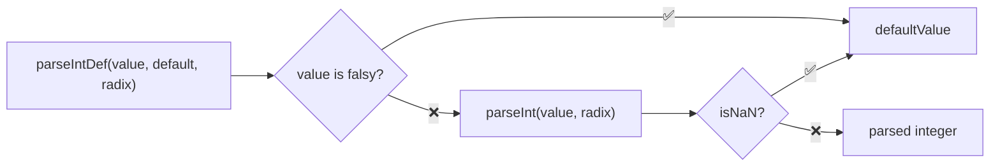
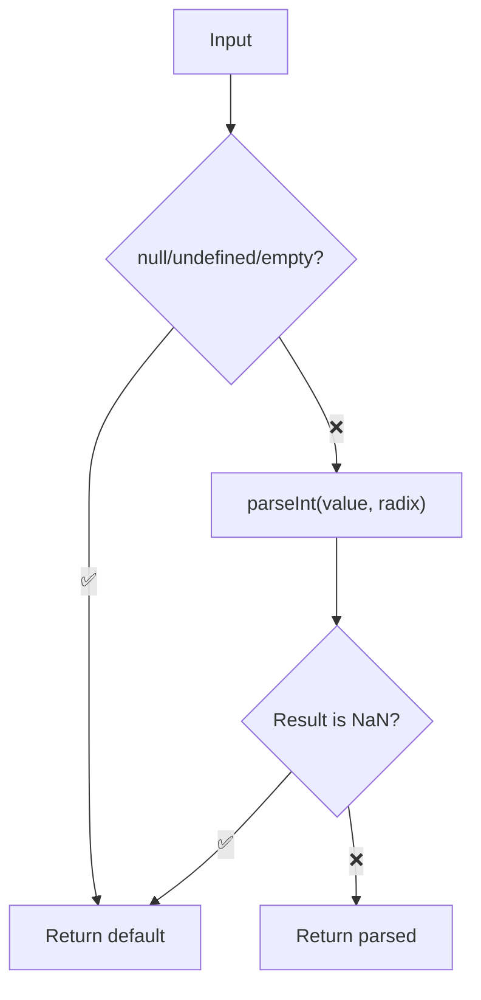

Parses a string to an integer with a fallback default value, supporting custom radix.

### Validation Flow

### Common Inputs

| Value | Default | Radix | Result |
|-------|---------|-------|--------|
| `'42'` | `null` | - | `42` |
| `'invalid'` | `0` | - | `0` |
| `'1010'` | `null` | `2` | `10` |
| `'FF'` | `null` | `16` | `255` |
| `null` | `0` | - | `0` |
