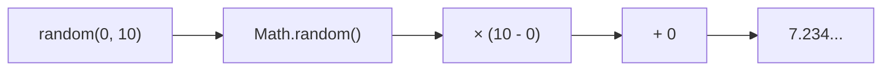
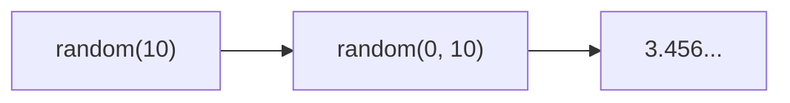
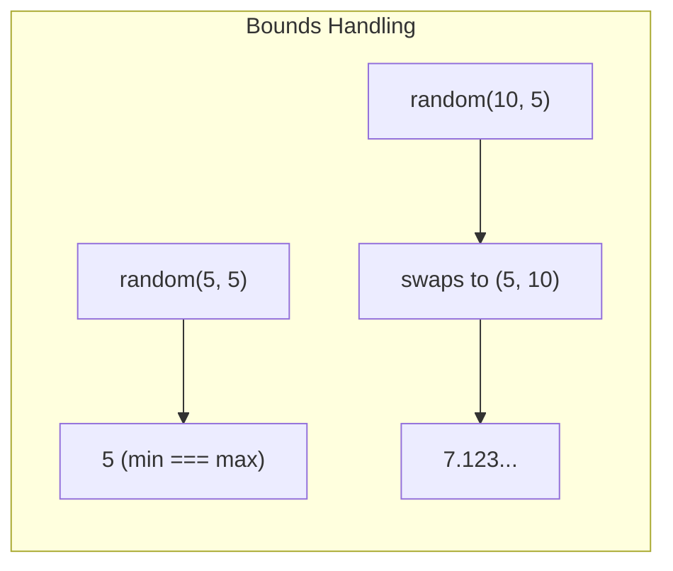
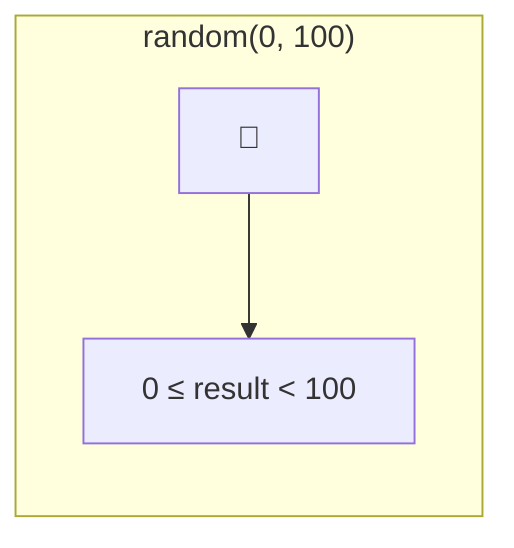

Generates a random number within a specified range [min, max).

```mermaid
flowchart LR
    A["random(0, 10)"] --> B["Math.random()"]
    B --> C["× (10 - 0)"]
    C --> D["+ 0"]
    D --> E["7.234..."]
```

### Single Argument (0 to max)

```mermaid
flowchart LR
    A["random(10)"] --> B["random(0, 10)"]
    B --> C["3.456..."]
```

### Edge Cases

```mermaid
flowchart LR
    subgraph "Bounds Handling"
        A["random(5, 5)"] --> B["5 (min === max)"]
        C["random(10, 5)"] --> D["swaps to (5, 10)"]
        D --> E["7.123..."]
    end
```

### Distribution

```mermaid
flowchart LR
    subgraph "random(0, 100)"
        R["🎲"] --> A["0 ≤ result < 100"]
    end
```
