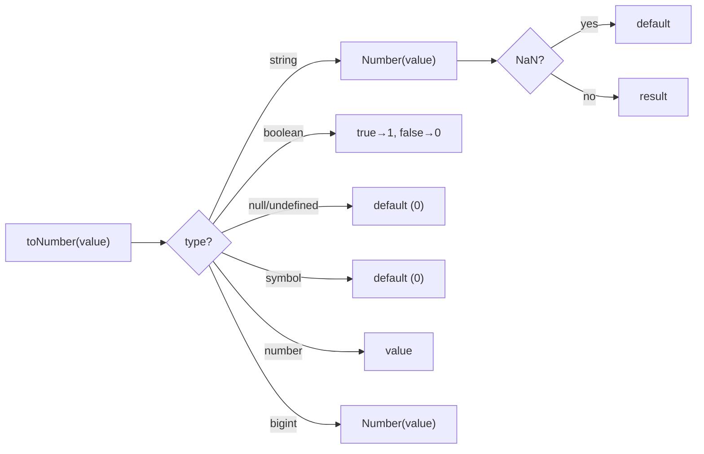
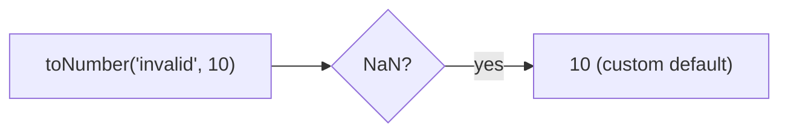

Converts any value to a number with fallback handling.

### Conversion Examples

| Input | Output |
|-------|--------|
| `'42'` | `42` |
| `'3.14'` | `3.14` |
| `'invalid'` | `0` (default) |
| `true` | `1` |
| `false` | `0` |
| `null` | `0` (default) |
| `10n` | `10` |

### Custom Default

