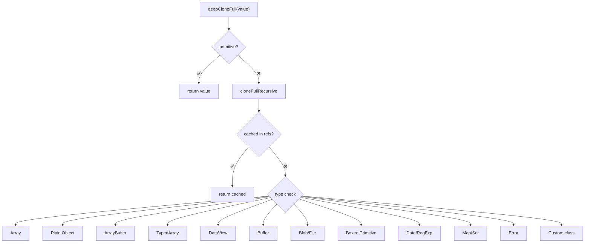
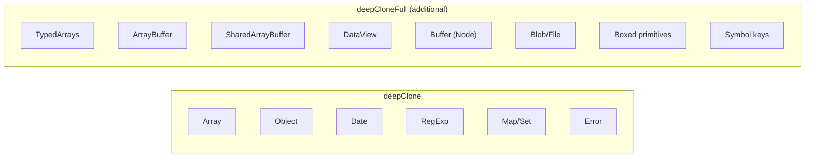
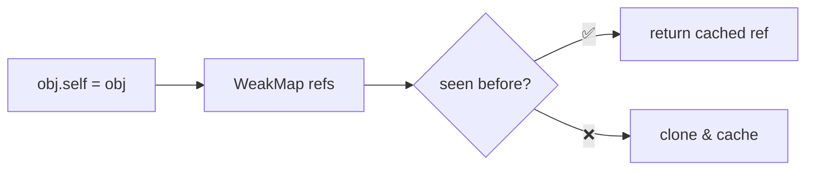

Creates a deep clone of any JavaScript value, handling ALL types including TypedArrays, Buffers, Blobs, and boxed primitives.

### Supported Types (vs deepClone)

### Circular Reference Handling

### Performance

| Type | Complexity |
|------|------------|
| Primitives | O(1) |
| Arrays/Objects | O(n) |
| Circular refs | O(1) lookup |
