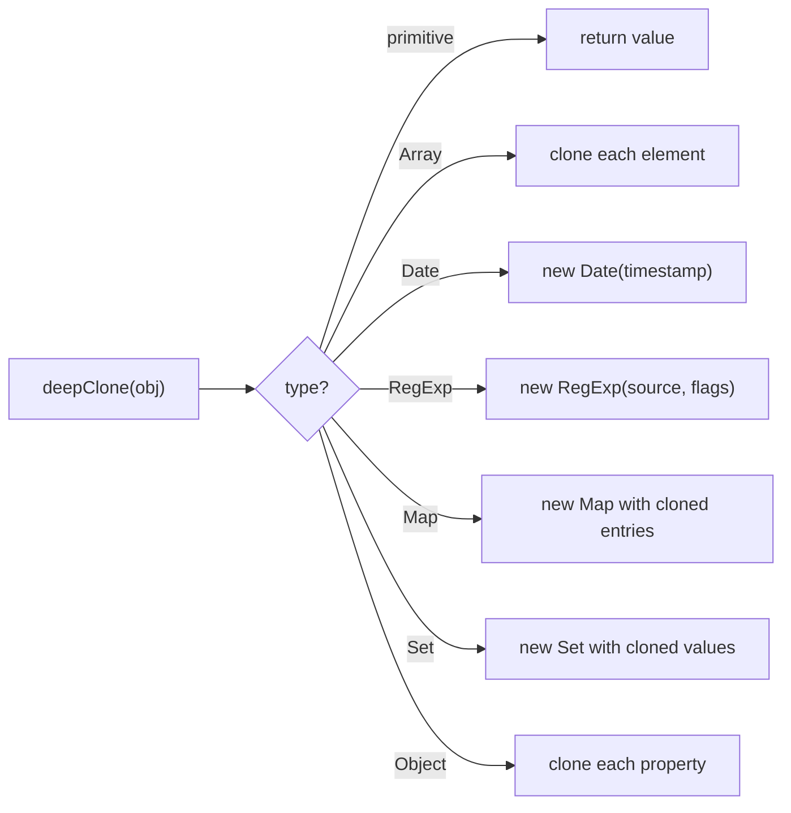
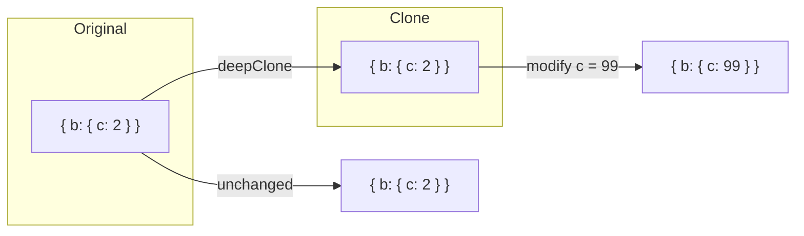
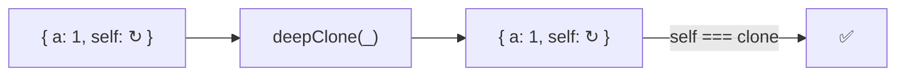

Creates a deep copy of a value, recursively cloning all nested structures.

```mermaid
flowchart LR
    A["deepClone(obj)"] --> B{"type?"}
    B -->|"primitive"| C["return value"]
    B -->|"Array"| D["clone each element"]
    B -->|"Date"| E["new Date(timestamp)"]
    B -->|"RegExp"| F["new RegExp(source, flags)"]
    B -->|"Map"| G["new Map with cloned entries"]
    B -->|"Set"| H["new Set with cloned values"]
    B -->|"Object"| I["clone each property"]
```

### Independence

```mermaid
flowchart LR
    subgraph "Original"
        A["{ b: { c: 2 } }"]
    end
    subgraph "Clone"
        B["{ b: { c: 2 } }"]
    end
    A -->|"deepClone"| B
    B -->|"modify c = 99"| C["{ b: { c: 99 } }"]
    A -->|"unchanged"| D["{ b: { c: 2 } }"]
```

### Circular Reference Handling

```mermaid
flowchart LR
    A["{ a: 1, self: ↻ }"] --> B["deepClone(_)"]
    B --> C["{ a: 1, self: ↻ }"]
    C -->|"self === clone"| D["✅"]
```
