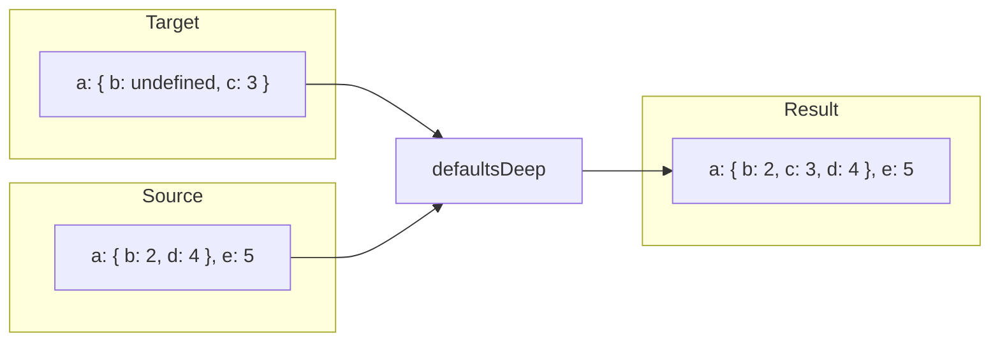
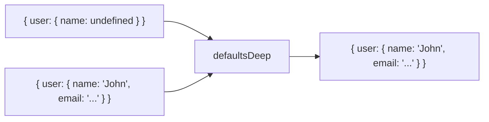

Recursively fills in undefined properties at all nesting levels.

### Deep Traversal

### defaults vs defaultsDeep

| | defaults | defaultsDeep |
|--|----------|--------------|
| **Scope** | Top-level only | All nesting levels |
| **Objects** | Replaced | Merged recursively |
