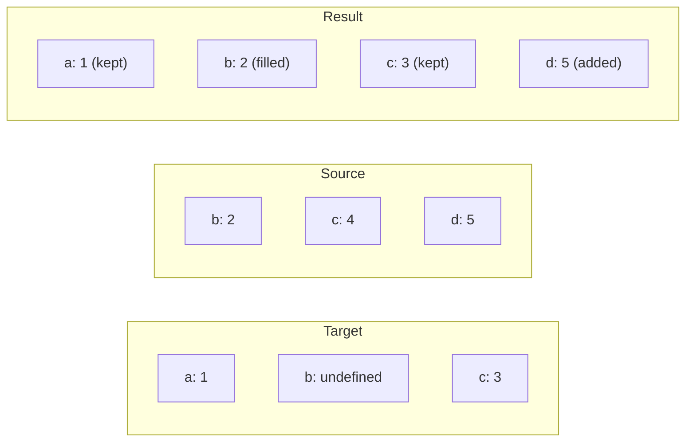
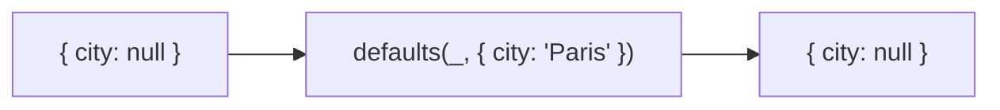
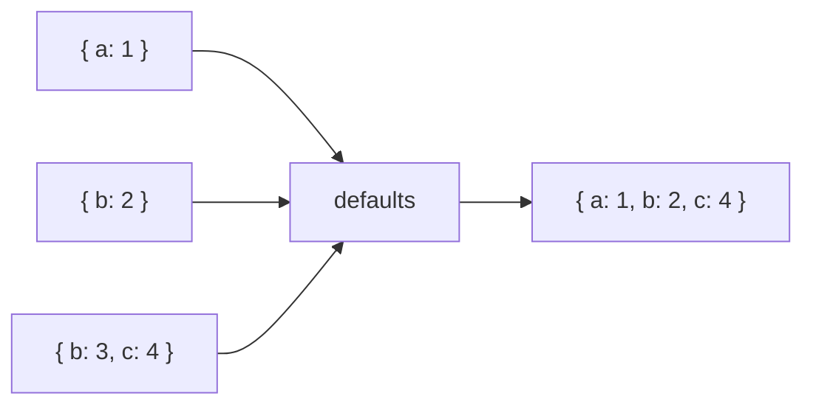

Fills in undefined properties with values from source objects.
Only `undefined` values are replaced — `null` is preserved.

### null vs undefined

`null` is preserved because it's a deliberate value, not absence.

### Multiple Sources

First source wins for each key.
