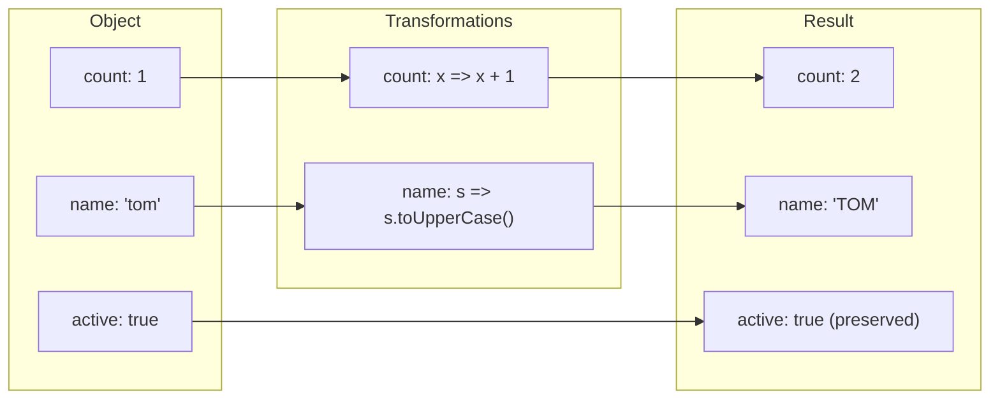
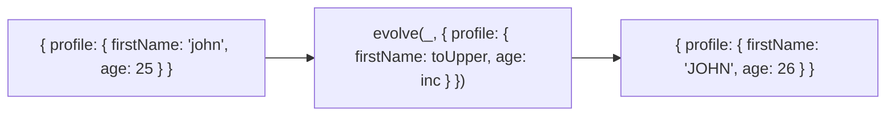

Applies transformations to an object in a declarative way.
Properties without transformations are preserved unchanged.

### Nested Transformations

### evolve vs mapValues

| | evolve | mapValues |
|--|--------|-----------|
| **Applies to** | Specific keys | All keys |
| **Preserves** | Untransformed keys | N/A |
| **Nested** | Supported | Manual |
