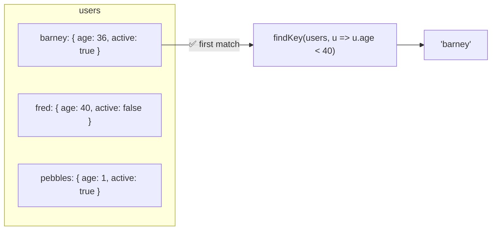
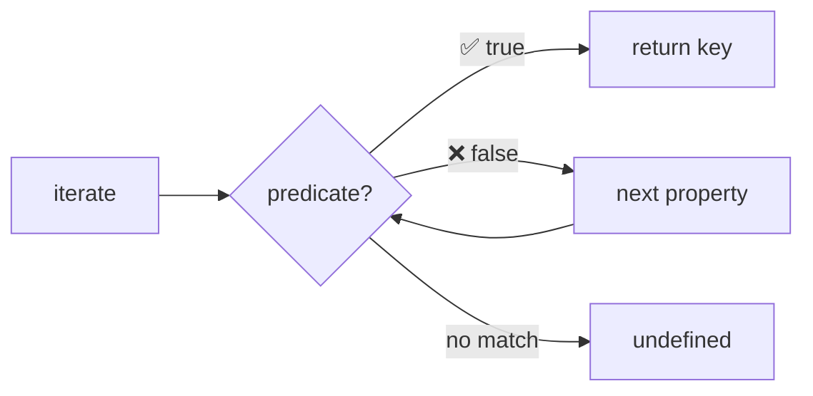
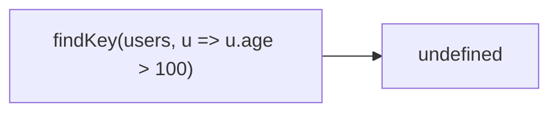

Returns the key of the first element that satisfies a predicate.

```mermaid
flowchart LR
    subgraph "users"
        A["barney: { age: 36, active: true }"]
        B["fred: { age: 40, active: false }"]
        C["pebbles: { age: 1, active: true }"]
    end
    D["findKey(users, u => u.age < 40)"]
    A -->|"✅ first match"| D
    D --> E["'barney'"]
```

### Search Process

```mermaid
flowchart LR
    A["iterate"] --> B{"predicate?"}
    B -->|"✅ true"| C["return key"]
    B -->|"❌ false"| D["next property"]
    D --> B
    B -->|"no match"| E["undefined"]
```

### Not Found

```mermaid
flowchart LR
    A["findKey(users, u => u.age > 100)"] --> B["undefined"]
```
